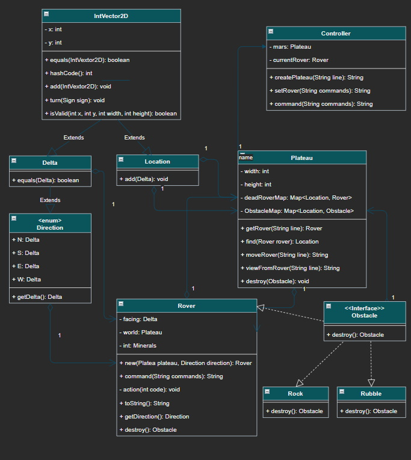

# Tech Returners Mars Rover Kata

## Summary of [The Brief]() 

From the brief we have:
* A Plateau - rectangular (Integer dimension) but no limit, provided by user on first input.
* One or more Rovers:
  * Location on grid - x, y (both Integers)
  * Direction d, relative to grid - one of {N, S, E, W} 
    * N => +ve y or delta grid of (0, 1)
    * S => -ve y or delta grid of (0, -1)
    * E => +ve x or delta grid of (1, 0)
    * W => -ve x or delta grid of (-1, 0)
  * Location and direction given on one line, space separated in order x, y, d
  * Receive instructions (commands) as a string of (initially) characters from {L, R, M}
    * L => turn left by 90 degrees
    * R => turn right by 90 degrees
    * M => move forward one unit
* Control device receives:
  * Plateau dimensions as inclusive maximum in order x then y - no response
  * Address of a rover in order x then y then d - no response
  * Command string - response is the final address of the rover as x then y then d 

### Initial design

* Three main classes:
  * Controller receives commands and actions them and responds if required
  * Plateau where the rovers roam - contains the rovers and their locations
  * Rovers move according to commands received - contain a direction

It may be simple, but we will have a [UML](doc/Mars.drawio). 
Drawing the [Initial UML](doc/Mars1UML.jpg) enabled me to identify some more utility classes:

* Direction - enum mapping to Deltas
* Delta - extends IntVector2D
* Location - extends IntVector2D
* IntVector2D - x & y container

On top of this, we will have a main method class to act as the console device.
To keep things clean we will put everything in its own package: com.tinkabell.rover

### Testing Strategy

Of course, we will be using TDD, but what do we need to support this?  As much of the class data is private,
and we don't want to break encapsulation, I will add protected inspectors, so we can see (but not touch) 
internal state to check void returning methods have changes state.  
There is no point in calling them if they do nothing!

In addition to this, many of the methods take integer and character inputs as space separated Strings.  
This will mean that there will be input format validation, so we will have to check for correct 
Invalid Input Exceptions (whatever they will be, but probably runtime exceptions) being thrown.

As the classes and supporting test classes evolve, they will be documented in the Git commit history. 

### First Design Adjustment

As I worked through the testing of the basic framework, I realised that some things that were built and tested
now needed to become private.  The create methods for Controller and Plateau should really be String only, 
unless we later expose a more native API.  Also realised that to at least test Rover creation, I will need 
to have an exposed getter for a Rover.  As above, I think the command method should take a Rover "String", 
rather than the Rover object, and that object will be created and used withing the method.  This required changes 
to the UML, so I now have a [2nd Edition UML](doc/Mars2UML.jpg) to show progress.

### Second Design Adjustment

As I formulated the testing of the Rover commands, I realised that there were methods missing in the Rover.
It also transpired that, although a Rover is created using a Direction, this is an enum and so immutable, 
so could not change direction.  These meant that a Delta rather than a Direction needed to be the main field.
Similarly, a Rover needed to know which Plateau it was on, so it could move.  
Finally, the Controller does not need to know what commands a Rover supports, so the string commands 
need to be passed through.  We will probably hide (make private) the individual movement commands in the Rover,
but the UML does not yet reflect this as we will add tests for the internal function during development and remove
their complexity once working.

### Completion of Original Brief

Once testing was complete and classes changed to suit, refined and documented, 
the [UML was adjusted](doc/Mars4UML.jpg) to match.

## First extension:

What to do next?  Information! So we need to add:

* Help - ? (and H) - list commands that are ok
* Plan / Plateau - P show a map of the plateau (can't use M)
* Camera - C - what is in the next grid place?
* View - V - extend camera to see the view - 90 degree view of up to 3 places 

My vision is that it wound be something like:

\   > /
 \   /
  \ /
Viewing another Rover facing right of this one, 3 grid away and 1 to the right.
Rover facing: left - <, right - >, away - A and towards - V
The edge of the plateau are mountains - M, and you can't see past them!

### First implementation

Just add the '?' / 'H' commands in the controller.  So split up an action string, and output a message 
appended to the messages from the Rovers / Plateau for the help command.

Also add a toString() for the plateau, listing the Rovers.

### Big design change

As I built and tested the first extension, I realised that the original brief had not defined the response
for errors.  Initially, I just used NumberFormatException as a generic runtime exception for invalid inputs.
As I developed the project further, this was stretched beyond viability, but continued.  It is time for a redesign.
The two methods that had no return value will now return an empty String if successful, and a String prefixed with
"Error".  The rest of the String will contain the Exception message text used before.  Similarly, the command() 
method will return the final Rover String followed by any error that may have occurred. 
This should remove a lot of the overuse of NumberFormatException, but still leave us with "fail fast" philosophy.
The [updated UML](doc/Mars5UML.jpg) reflects this change.
A further adjustment to the Plateau (adding viewFromRover()) showed that I had missed the moveRover() method from the
UML.  Again this method that used RuntimeExceptions rather than return value has been "corrected" and both methods
added to the [further updated UML](doc/Mars6UML.jpg)

## Second extension:

This will be multipart extension.  The idea is to make a playable game.

1. Add new commands:
   * F - to "fire" the industrial laser (ray gun?) the destroys whatever is in the next grid place
     * As this is heavy duty, it will take a number of turns (3 initially) to recharge, so use it sparingly
     * Eventually it will "destroy" the target and leave a pile of rubble that can be mined with the digger
   * D - to "dig" with the mining tool and extract from rubble (after using laser) and gain minerals
   * A - to switch on the "auto camera" which will record what is in front of the rover until it stops.   
2. Add single executable game
   1. Accepts "named" rovers
   2. Creates world for the rovers and drops them in
   3. May create rocks (M - mountains) that can be destroyed to rubble (m - small mountains of rubble) that can be mined
   4. Prompts for each surviving rover in turn to receive commands and return output (without location descriptors)
   5. Ends when only one rover remains at tells you your score in minerals
3. Add server / multiple processor version
   1. Similar to the above but the world is hosted on a "server"
   2. The controller only accepts commands for one rover and responds
   3. The server controls sequencing, and, to ensure nothing blocks, will skip turns if no rover commands received
4. To either of the above game versions add AI rovers to add to the battle?

### Design change

* The Plateau will need a map of Obstacles (interface) rather than Rovers, but will need a map of dead Rovers when  
  they have been destroyed between turns
* All Obstacles will be destroyable, but some will become mine-able
* Rovers will gain minerals (from mining) and these will be added to the "rubble" if they are destroyed to be collected
  by other Rovers.
* Introduce Rocks (M) and Rubble (m) as concrete classes of Obstacle
* Introduce the population of Plateaus with Rocks - may be varying sizes.

## Changes, changes, changes

I am very aware that design changes rarely get back to the documentation!  Unless there is a way to easily reflect
that actual design (e.g. Javadoc) the code moves on a pace and the external docs get left behind!
I have no intention of redrawing the UML anymore.  After all, I was not planning to make many more changes in any case!
Suffice to say that, with the attempts to "gamify" the Mars Rover, there has been a need to modify the  Plateau class
and create a new super class (SuperPlateau ?) to encapsulate some game environment.  The TurnBaseGame class is also 
being restructured, so it may be possible to include proper client - server comms.

Well we got to a working turn based game on one machine!

